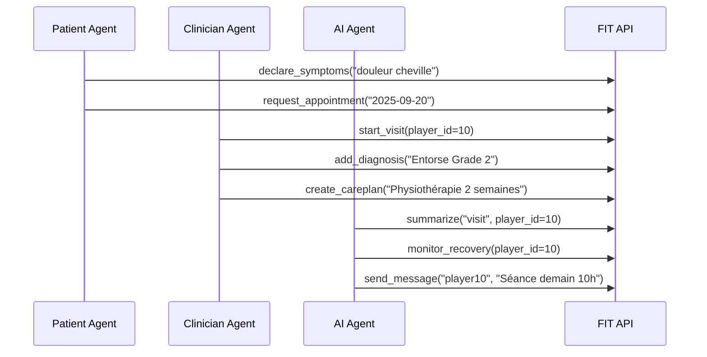
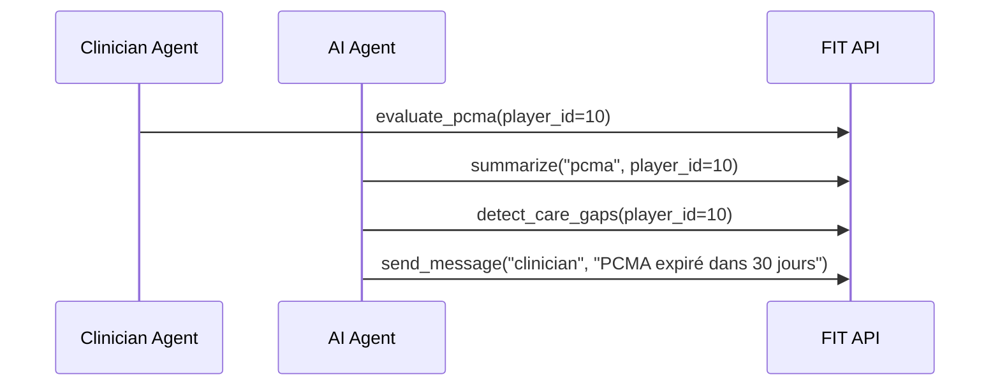

# Architecture FIT CLI

## 🏗️ Vue d'ensemble

FIT CLI est un assistant en ligne de commande qui permet aux différents rôles (Joueur/Patient, Clinicien, Agent IA) d'interagir avec les modules existants de l'application FIT via des APIs REST et FHIR.

## 📐 Architecture Générale

```
┌─────────────────────────────────────────────────────────────┐
│                    FIT CLI                                  │
├─────────────────────────────────────────────────────────────┤
│  ┌─────────────┐  ┌─────────────┐  ┌─────────────┐        │
│  │   Agent     │  │   Agent      │  │   Agent     │        │
│  │  Patient    │  │  Clinicien   │  │     IA      │        │
│  │ (Joueur)    │  │              │  │             │        │
│  └─────────────┘  └─────────────┘  └─────────────┘        │
├─────────────────────────────────────────────────────────────┤
│                    Base Agent                               │
│  ┌─────────────────────────────────────────────────────────┐ │
│  │              Configuration & Auth                      │ │
│  │  ┌─────────────┐  ┌─────────────┐  ┌─────────────┐   │ │
│  │  │   Config    │  │   Auth       │  │   Logging    │   │ │
│  │  │             │  │             │  │             │   │ │
│  │  └─────────────┘  └─────────────┘  └─────────────┘   │ │
│  └─────────────────────────────────────────────────────────┘ │
├─────────────────────────────────────────────────────────────┤
│                    API Clients                             │
│  ┌─────────────┐  ┌─────────────┐  ┌─────────────┐        │
│  │   FIT API   │  │   FHIR API   │  │   Auth API   │       │
│  │   Client    │  │   Client     │  │   Client     │       │
│  └─────────────┘  └─────────────┘  └─────────────┘        │
└─────────────────────────────────────────────────────────────┘
                              │
                              ▼
┌─────────────────────────────────────────────────────────────┐
│                    FIT Application                          │
├─────────────────────────────────────────────────────────────┤
│  ┌─────────────┐  ┌─────────────┐  ┌─────────────┐        │
│  │ Secrétariat │  │   Visites   │  │    PCMA     │        │
│  │  Médical    │  │  Médicales  │  │             │        │
│  └─────────────┘  └─────────────┘  └─────────────┘        │
├─────────────────────────────────────────────────────────────┤
│  ┌─────────────┐  ┌─────────────┐  ┌─────────────┐        │
│  │   FHIR      │  │   Clinical  │  │   AI        │        │
│  │   APIs      │  │   Workflow  │  │   Support   │        │
│  └─────────────┘  └─────────────┘  └─────────────┘        │
└─────────────────────────────────────────────────────────────┘
```

## 🔧 Composants Principaux

### 1. Agents Spécialisés

#### 👤 Agent Patient (Joueur)

- **Responsabilités** : Déclarer symptômes, gérer rendez-vous, consulter dossier
- **Permissions** : `read:own_data`, `create:symptoms`, `request:appointments`
- **APIs utilisées** : FHIR Observations, Secretary Appointments, Healthcare Visits

#### 🩺 Agent Clinicien

- **Responsabilités** : Visites médicales, diagnostics, plans de soins, PCMA
- **Permissions** : `read:all_data`, `create:diagnosis`, `create:careplan`, `evaluate:pcma`
- **APIs utilisées** : FHIR Encounters, Conditions, CarePlans, PCMA APIs

#### 🤖 Agent IA

- **Responsabilités** : Résumés automatiques, monitoring, messages, preuves médicales
- **Permissions** : `read:all_data`, `create:summaries`, `monitor:recovery`, `send:messages`
- **APIs utilisées** : Clinical Workflow APIs, AI Support APIs

### 2. Système de Configuration

#### Configuration (.fitconfig)

```ini
[api]
base_url = "http://localhost:8000"
api_prefix = "/api"
timeout = 30

[auth]
token_endpoint = "/oauth/token"
client_id = "fit-cli"
client_secret = "fit-cli-secret"
scope = "read write"

[fhir]
base_url = "http://localhost:8000/api/clinical"
version = "R4"
```

#### Authentification

- **OAuth2** : Authentification principale avec tokens JWT
- **Fallback** : Authentification basique pour la démo
- **Gestion des rôles** : Permissions basées sur les rôles utilisateur

### 3. Clients API

#### FIT API Client

- **Endpoints** : Secrétariat, Visites, PCMA, Healthcare
- **Méthodes** : GET, POST, PUT, DELETE
- **Gestion d'erreurs** : Codes HTTP standardisés

#### FHIR API Client

- **Ressources** : Patient, Encounter, Condition, CarePlan, Observation
- **Standards** : FHIR R4 compliant
- **Mapping** : Joueur → Patient, Visite → Encounter

## 🔄 Workflows Intégrés

### Workflow 1 : Blessure → Consultation → Plan de soins → Suivi IA



### Workflow 2 : Évaluation PCMA → Suivi IA



## 🗂️ Mapping FHIR

### Ressources FHIR Utilisées

| Ressource FHIR    | Équivalent FIT      | Description                        |
| ----------------- | ------------------- | ---------------------------------- |
| Patient           | Joueur              | Informations du joueur/patient     |
| Encounter         | Visite médicale     | Consultation ou visite             |
| Condition         | Diagnostic/Blessure | Condition médicale diagnostiquée   |
| CarePlan          | Plan de soins       | Plan de traitement et récupération |
| Observation       | Symptômes/Résultats | Observations cliniques             |
| Appointment       | Rendez-vous         | Rendez-vous secrétariat            |
| DocumentReference | Résumé IA           | Documents générés par l'IA         |

### Exemples de Mapping

#### Patient → Joueur

```json
{
  "resourceType": "Patient",
  "id": "player_10",
  "identifier": [
    {
      "system": "fit-player-id",
      "value": "10"
    }
  ],
  "name": [
    {
      "family": "Ben Ali",
      "given": ["Mohamed"]
    }
  ],
  "gender": "male",
  "birthDate": "1990-01-15"
}
```

#### Encounter → Visite médicale

```json
{
  "resourceType": "Encounter",
  "id": "visit_123",
  "status": "finished",
  "class": {
    "code": "AMB",
    "display": "ambulatory"
  },
  "subject": {
    "reference": "Patient/player_10"
  },
  "period": {
    "start": "2025-01-17T10:00:00Z",
    "end": "2025-01-17T10:30:00Z"
  }
}
```

## 🔐 Sécurité et Permissions

### Modèle de Permissions

```python
PERMISSIONS = {
    'patient': [
        'read:own_data',
        'create:symptoms',
        'request:appointments'
    ],
    'clinician': [
        'read:all_data',
        'create:diagnosis',
        'create:careplan',
        'evaluate:pcma'
    ],
    'secretary': [
        'manage:appointments',
        'read:schedule'
    ],
    'ai': [
        'read:all_data',
        'create:summaries',
        'monitor:recovery',
        'send:messages'
    ]
}
```

### Authentification

1. **OAuth2 Flow** : `password` grant type
2. **JWT Tokens** : Tokens d'accès avec expiration
3. **Refresh Tokens** : Renouvellement automatique
4. **Scope-based** : Permissions granulaires

## 🚀 Déploiement

### Containerisation

```dockerfile
FROM python:3.11-slim
WORKDIR /app
COPY requirements.txt .
RUN pip install -r requirements.txt
COPY fit_cli/ ./fit_cli/
COPY fit ./fit
RUN chmod +x ./fit
USER fit-cli
ENTRYPOINT ["./fit"]
```

### Kubernetes

```yaml
apiVersion: apps/v1
kind: Deployment
metadata:
  name: fit-cli
spec:
  replicas: 1
  selector:
    matchLabels:
      app: fit-cli
  template:
    metadata:
      labels:
        app: fit-cli
    spec:
      containers:
        - name: fit-cli
          image: fit-cli:latest
          env:
            - name: FIT_API_URL
              value: 'http://fit-api:8000'
            - name: FIT_FHIR_URL
              value: 'http://fit-api:8000/api/clinical'
```

## 📊 Monitoring et Logs

### Logging

- **Niveau** : INFO, DEBUG, ERROR
- **Format** : JSON structuré
- **Rotation** : Quotidienne
- **Rétention** : 30 jours

### Métriques

- **Requêtes API** : Nombre, latence, erreurs
- **Authentification** : Succès/échecs, tokens expirés
- **Agents** : Actions exécutées, permissions utilisées
- **Erreurs** : Types, fréquences, résolutions

## 🔧 Maintenance

### Tests

- **Unitaires** : Chaque agent et méthode
- **Intégration** : Workflows complets
- **End-to-end** : Scénarios réels
- **Performance** : Latence et débit

### Mise à jour

- **Versioning** : Semantic versioning
- **Migration** : Configuration et données
- **Rollback** : Retour en arrière rapide
- **Documentation** : Changelog détaillé
